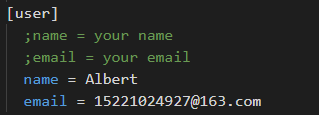
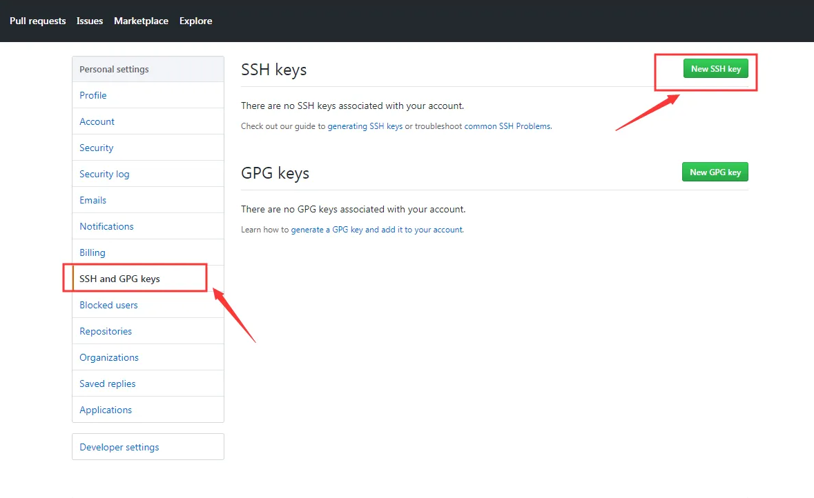

# speak English

Author: :boy:Albert  :email:  15221024927@163.com, C/C++ software engineer.

:girl:Elena  :email:   huimin0099@163.com, Electronic communication engineer

## NOTE: We should speak each sentence carefully, accurately, and skillfully!

Let's speak English.
* [Chapter_1 《speak English》](https://github.com/wwwwwalter/speak-English/blob/main/speak%20English.md)
* [Chapter_2 《roots and affixes》](https://github.com/wwwwwalter/speak-English/blob/main/roots%20and%20affixes.md)
* [Chapter_3 《Processon Online》](https://www.processon.com/view/link/628f55701efad466f356648f)
* [Chapter_4 《Grammar Online》](http://www.en998.com/sentence/)

## :heartbeat: Welcome to contribute your wisdom to the repository.

**Some software you might use**

  * [Git](https://git-scm.com/docs)
  * [Fork](https://git-fork.com/)
  * [GitHub](https://docs.github.com/cn/get-started/quickstart/hello-world)
  * [Typora](https://pan.baidu.com/s/1L29j-3L2CfjRi2U7VFhT7Q?pwd=vc7p)
  * [Markdown](https://www.jianshu.com/p/191d1e21f7ed)


---
**Step 1: GIt configuration** 

copy `help document/Git/.gitconfig` file to your home folder, like `C:/Users/gzyit`. This configuration file contains your identity and email address, as well as the configuration of some other functions. All Git clients will automatically search for this configuration file on your system. If the file is not found, they generate a new configuration file, which is not expected.

> Don't forget to change your name and email address to your own.



**Step 2: ssh configuration**

If you don't want to manually enter the account name and password every time you submit a code, you're better off generating an SSH key pair locally. 

```shell
open git-shell
$ ssh-keygen
```

Running this command on a terminal will generate a .ssh directory with a pair of passwords in your user directory. The pub is the public key, and the other private key should be protected. Then copy the public key into your GitHub SSH manager.




**Step 3: Git commit format**

In order to quickly see what was committed, we agreed to write the commit log in the following format.

```c
new file: + filename
edit file: * filename
delete file: - filename
```

---

We should speak each sentence carefully, accurately, and skillfully!
